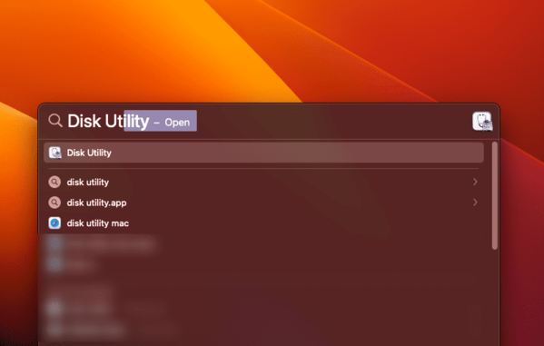
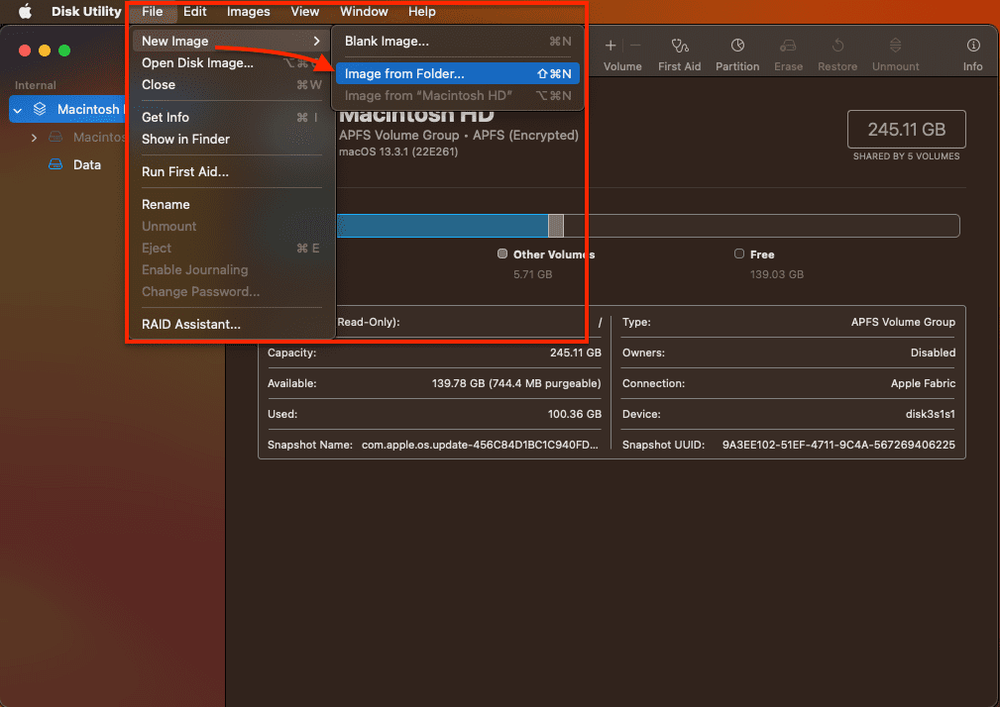

# Password Protect Folder - Files on MacOS

&nbsp;

**EXAMPLE STEPS FOR APPLYING IT ON A MACBOOK M1 DEVICE**

    

 

&nbsp;

    

 

&nbsp;

&nbsp;

&nbsp;

---

&nbsp;

    

 

&nbsp;

---

&nbsp;

&nbsp;

&nbsp;

&nbsp;

&nbsp;